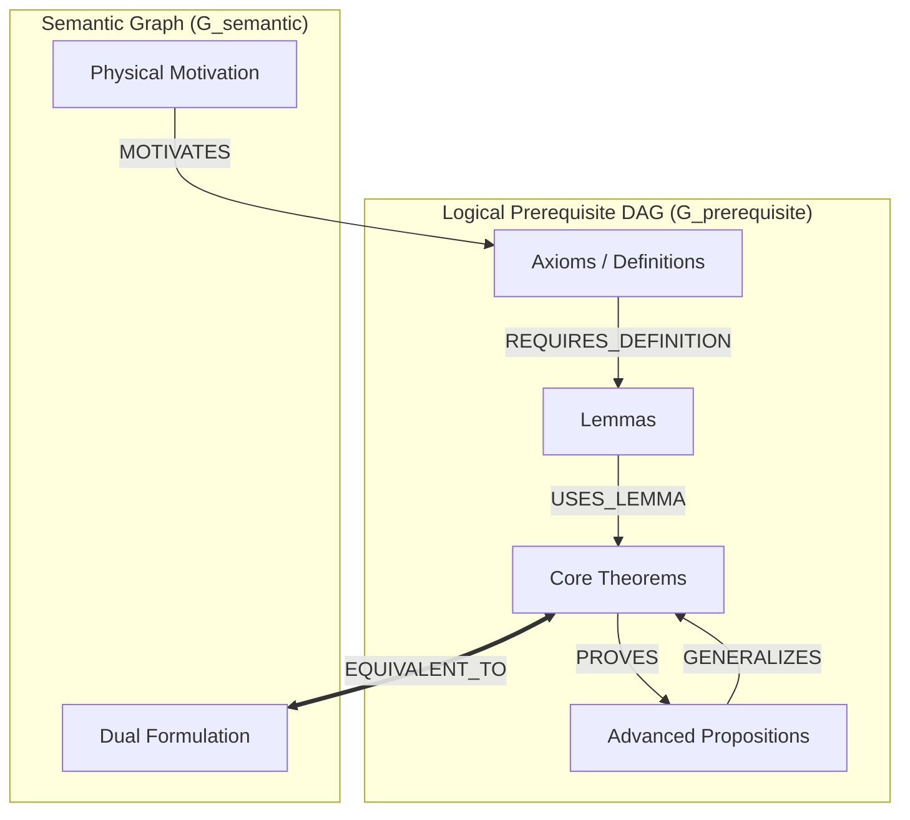

# MathUniverse 🌌

> **The Open-Source Mathematics Knowledge Base & Formal Verification Platform**  
> *Bridging human mathematical intuition, rigorous multi-paradigm proofs, and Lean 4 formal verification.*

[](LICENSE)
[](tests/)
[](https://nextjs.org/)
[](https://lean-lang.org/)

---

## 🌟 Overview

MathUniverse is an interactive mathematical knowledge exploration platform. It combines:
1. **Mathematical Intuition & Historical Context**: Bilingual (English / Chinese) deep explanations, geometric motivations, and historical milestones.
2. **Dual-Graph Architecture**:
   - $G_{\mathrm{prerequisite}}$: A strict **Directed Acyclic Graph (DAG)** governing foundational logical derivations and learning pathways.
   - $G_{\mathrm{semantic}}$: A flexible **Semantic Multi-Graph** capturing equivalences ($A \iff B$), generalizations, specializations, and motivations.
3. **Formal Verification Provenance**: Lean 4 code with cryptographic statement and source code hashes, Mathlib commit bindings, and kernel axiom tracking.
4. **Academic Export Studio**: One-click generation of compile-ready **LaTeX papers**, **Typst documents**, **Beamer presentation slides (16:9)**, **Quarto notebooks**, and **TikZ commutative diagrams**, with direct Overleaf integration.
5. **Interactive Interactive Labs**:
   - 🪐 **Cosmos 3D Star Chart**: Force-directed topological celestial map of mathematical disciplines.
   - 🕵️ **Fallacy Lab (Mathematical Detective)**: Interactive fallacy detection with step-by-step counterexamples and formal refutations.
   - 📐 **Commutative Diagram Studio**: Dynamic category-theoretic diagrams and exact sequences.

---

## 🏗️ Architecture & Mathematics Ontology

For detailed theoretical specifications, see [docs/architecture.md](docs/architecture.md).



---

## 🚀 Getting Started

### Prerequisites
- Node.js 20+ (recommended: Node.js 22 or 24)
- npm 10+

### Installation & Development
```bash
# 1. Clone the repository
git clone https://github.com/candle233/MathUniverse.git
cd MathUniverse

# 2. Install dependencies
npm install

# 3. Start development server (port 5050)
npm run dev

# 4. Open in browser
# http://localhost:5050
```

### Testing & Verification
```bash
# Run complete test suite (1200+ unit, integration, chaos, and property-based tests)
npm test

# Run property-based graph theory invariant tests
npm run test:pbt

# Run production build
npm run build
```

---

## 📜 Project Structure

```
mathuniverse/
├── src/
│   ├── app/                 # Next.js 15 App Router pages
│   ├── components/          # UI Components (3D Cosmos, Lean Verifier, Node Detail, Export Studio)
│   ├── context/             # LanguageContext & Application State
│   ├── data/                # Audited Mathematical Seed Data & Fallacy Cases
│   ├── i18n/                # Strict bilingual dictionary (zh / en)
│   ├── lib/                 # DAG Engine, Prerequisite Closure, Export Studio, Numerical Engines
│   └── types/               # Mathematical Ontology v2 TypeScript Schemas
├── tests/                   # 18 Unified Test Groups & Property-Based Test Suites
├── docs/
│   ├── architecture.md      # Technical specification & Dual-Graph ontology
│   └── roadmap.md           # Development roadmap
├── LICENSE                  # MIT License
└── package.json
```

---

## 🗺️ Roadmap

See [docs/roadmap.md](docs/roadmap.md) for current features and upcoming milestones.

---

## 📄 License

This project is licensed under the MIT License - see the [LICENSE](LICENSE) file for details.
